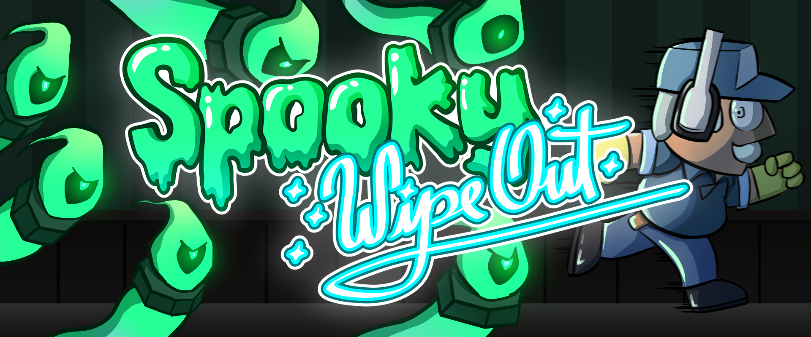

# Spooky Wipe Out

Spooky Wipe Out is a casual cleaning game but the place you are cleaning is  haunted!

Good news! You play as Manolo, an expert janitor and better ghost hunter. Manolo has to clean the whole house as fast as possible to maintain the reputation of his company, “Manolo Cleaning Services Inc.”.

Wash and vacuum the house while chasing any ghost standing in your way. Play your way as you become the ultimate haunted house cleaner.

This is a game being developed by students from <a href="https://www.imagecampus.edu.ar/">Image Campus</a>

   

## Credits

- **Carolina Pohn** - *Programming*
- **Mateo Viko Monastra** - *Programming*
- **Franco Porte Petit** - *Art*
- **Tomas Spinella** - *Art*
- **Fiorela Gaston** - *Art*
- **Santiago Garrido** - *Art*
- **Cristobal Cadierno** - *Audio*
- **Marc Gonzales** - *Audio*
- **Arhenea Machiavelo De Villers** - *Audio*
- **Julian Tinao** - *Audio*
- **Nahuel Brizuela Barbosa** - *QA*
- **Matias Gomez** - *QA*
- **Damian Palla** - *QA*
- **Federico Rattay** - *QA*
- **Matias Rosatto** - *QA*

This game was also possible thanks to the support of:

**Professors:**

- Sergio Baretto
- Juan Pablo Varela Aloisio
- Ramiro Cabrera
- Eugenio Taboada
- Nazareno Rivero
- Lucía Patetta

**Teaching assistants:**

- Rocío Giménez
- Ignacio Arrastua
- Lautaro Lajmanovich
- Manuel Sanchez
- Lucio Ary Clementino
- Florencia Gordano

**and all Image Campus Staff!**

## Links

Download it from itch.io: https://mateo-monastra.itch.io/spooky-wipe-out
